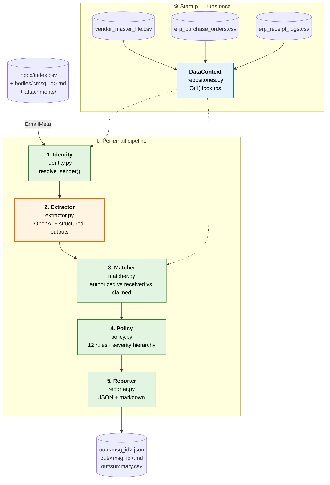

# AI-Assisted Financial Verification Pipeline

A per-email decision pipeline that automates the **three-way match** for Accounts Payable: given a vendor email, decide whether to APPROVE, HOLD, or REJECT a payment, with structured reasons an AP human can act on.

---

## Architecture

### The Five-Stage Pipeline

Orange = LLM boundary. Green = deterministic Python.



---

## Core Design Decisions

### 1. LLM Only at the Boundary

The LLM (Stage 2) extracts structured fields: PO numbers, invoice amount, currency, IBAN, intent. Everything downstream—identity, matching, policy—is deterministic Python.

**Why:** The LLM is non-deterministic and can hallucinate. Isolating it makes the system auditable. If a decision is wrong, you can trace it: "the LLM extracted X, the matcher found Y, rule Z fired."

### 2. All Rules Fire; Severity Hierarchy Decides

Twelve policy rules are evaluated for every email. All reasons are collected. The highest severity wins: REJECT > HOLD > APPROVE.

**Why:** AP wants the full picture, not just the first problem. Example: an email has both IBAN_MISMATCH (fraud) and MISSING_PO_REFERENCE (bad data). AP sees both.

### 3. Three-Way Match: Authorized vs Received vs Claimed

The matcher compares:
- **Authorized** — what the PO line items total
- **Received** — what goods receipts confirm (by quantity × unit price)
- **Claimed** — what the invoice asks for

**Why:** Catches overpayment and underpayment. Example: PO authorizes 1000 SEK, only 700 worth of goods arrived, invoice claims 1000. Rule UNDERDELIVERED fires: HOLD. AP can then clarify with the vendor before paying.

### 4. Repository Pattern: CSV Once, O(1) Lookups

CSVs (vendors, POs, receipts) are loaded once at startup into in-memory dictionaries. Each rule reads only from memory, no I/O during processing.

**Why:** Scales to any email volume. At 77 emails: 154 seconds serial, ~30 seconds with 5 workers (LLM-bound, not I/O-bound). At 77M emails: still 1-2 MB in memory, same O(1) lookup cost. Only the LLM call scales with volume.

---

## Design Insights (Lessons Learned)

1. **Load data once, not per-rule.**
   - **Why:** Early concern was "won't we hit the database for every rule match?" The answer: don't. Load CSVs once at startup into O(1) dicts (vendor_id → Vendor, po_number → POLines, etc.). Rules read from RAM.
   - **Payoff:** Scales cleanly. 77 emails or 77M emails—data layer cost is constant. Only the LLM call (network I/O) scales with volume.

2. **Deterministic Python after the LLM.**
   - **Why:** The LLM is non-deterministic and can hallucinate. Isolate it to one job (extract fields). Everything else—identity, matching, policy—is pure Python.
   - **Payoff:** Auditability. If a decision is wrong, you trace it step-by-step: "LLM extracted this → matcher found that → rule X fired." You can't do that if the LLM is buried in policy logic.

3. **All rules fire; severity wins.**
   - **Why:** Don't short-circuit at the first problem. Collect all reasons that fired. Let severity hierarchy (REJECT > HOLD > APPROVE) pick the final decision.
   - **Payoff:** AP sees the full picture. Example: email has both IBAN_MISMATCH (fraud signal) and MISSING_PO_REFERENCE (bad data). AP investigates both, not just one.

4. **Three-way match is the core.**
   - **Why:** Compare three amounts: authorized (PO), received (receipts), claimed (invoice). This one comparison catches overpayment, underpayment, partial delivery, and fraud.
   - **Payoff:** A vendor can't just invoice the full PO amount if goods haven't arrived. The system catches it automatically.

5. **Structured outputs, not manual parsing.**
   - **Why:** OpenAI's structured outputs *guarantee* the JSON conforms to your schema. The model can't return the wrong type or invent fields.
   - **Payoff:** No fragile string parsing, no "if the field is missing, guess a default," no hallucinated values. Schema compliance is enforced by the API.

6. **Embarrassingly parallel.**
   - **Why:** Each email is independent: read-only data, no shared state, one LLM call, write to separate output file. No locks needed.
   - **Payoff:** ThreadPoolExecutor with N workers gives ~Nx speedup with zero coordination overhead. 77 emails: 5 workers = 5x faster, trivial to implement.

---

## Running the System

```bash
# Install dependencies
uv sync

# Small demo (5 emails)
uv run python3 -m verifier.cli --data-dir candidate-package/data --out demo_out --limit 5 --verbose

# Full run (77 emails, 5 workers)
uv run python3 -m verifier.cli --data-dir candidate-package/data --out demo_out --workers 5
```

Then view a decision:
```bash
cat demo_out/M-0001.md
```

---

## Real Results

77 vendor emails run through the pipeline:
- **38 APPROVE** — known vendors, all checks pass
- **23 HOLD** — soft signals: domain-only matches, missing POs, currency mismatches
- **16 REJECT** — hard fraud signals: unknown senders, IBAN mismatches, vendor PO mismatches

---

## Code Map

| Module | Key Classes/Functions | Purpose |
|--------|----------------------|---------|
| `repositories.py` | `VendorRepository`, `PORepository`, `ReceiptRepository`, `DataContext` | In-memory O(1) lookups (loaded once at startup) |
| `schemas.py` | `Vendor`, `POLine`, `Receipt`, `ExtractedEmail`, `Decision`, `Severity`, `ResolvedVendor`, `MatchResult` | Pydantic data models (the contract) |
| `identity.py` | `resolve_sender()` | Stage 1: match sender email to vendor |
| `extractor.py` | `OpenAIExtractor.extract()`, `load_raw_email()`, `build_user_message()`, `SYSTEM_PROMPT` | Stage 2: LLM extraction via structured outputs |
| `matcher.py` | `match_email()`, `_match_one_po()`, `_worst_condition()` | Stage 3: three-way match (authorized vs received vs claimed) |
| `policy.py` | `decide()`, `rule_unknown_sender`, `rule_iban_mismatch`, `rule_overbilling`, `rule_underdelivered`, ... (12 total) | Stage 4: 12 policy rules + severity hierarchy |
| `reporter.py` | `render_markdown()`, `write_decision()`, `write_summary_csv()` | Stage 5: JSON + markdown audit trails |
| `pipeline.py` | `Pipeline.process()` | Orchestration: wires all 5 stages |
| `cli.py` | `main()` | CLI entry point: loads data, runs pipeline, writes reports |

---

## Example: M-0003 (UNDERDELIVERED)

Vendor V-010 invoices for 16,570 SEK against PO-2026-0010. But:
- Line 3 (CAL-001): ordered 3 units, received 0 units

**Calculation:**
- Authorized: 2×1052 + 6×1586 + 3×1650 = 16,570 SEK
- Received: 2×1052 + 6×1586 + 0×1650 = 11,620 SEK
- Claimed: 16,570 SEK

**Policy fires UNDERDELIVERED:** claimed (16,570) > received (11,620) → HOLD

**AP action:** Contact vendor to clarify missing line 3 before paying.
